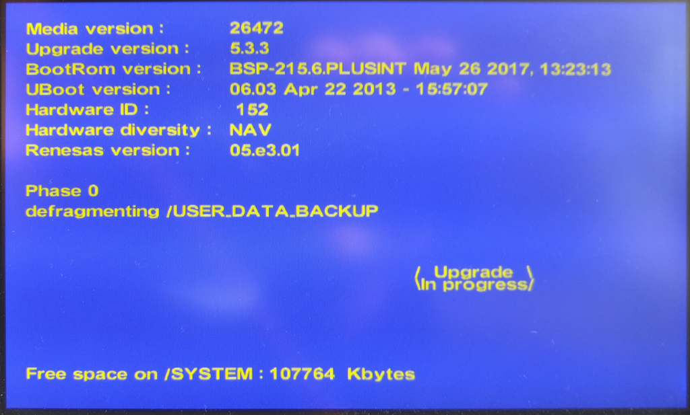
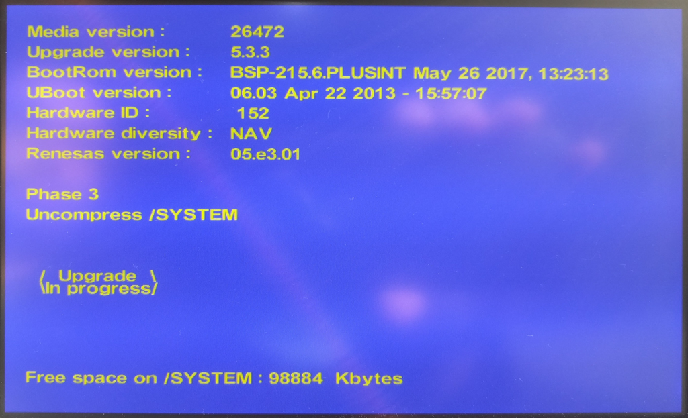
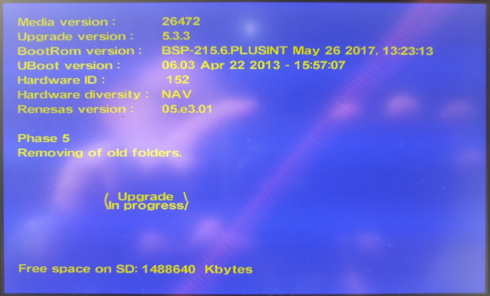
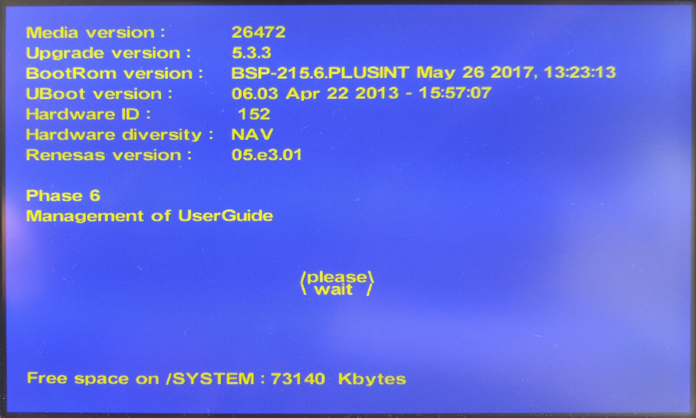

# SMEG+ Firmware Analysis

This repo will centralize few item founds on forums regarding SMEG firmware.

Thanks to @DarkSino and @pixx for their notes on SMEG inner mecanics.
Thanks to @MWyann that developped a RaspberryPi USB key that acts as a connected key from PSA.

Rather than trying to understand **vxWorks** that seems to act similarly to a kernel in linux, I bent digged into the upgrade process which sets everything at it's right place. Thus it offers the perfect opportunity to understand how the SMEG works. Cherry on the cake, the upgrade binary is in ELF format, and consequently analysis will be far more easy ! 

## SMEG Hardware

    -> version
    VxWorks (for Freescale MPC5121E ADS (Rev 0.1)) version 6.7.
    Kernel: WIND version 2.12.
    Made on May 26 2017, 13:23:36.
    Boot line:
    usb(0,0)host:vxWorks h=192.168.10.2 e=192.168.10.1 u=5121 pw=5121 f=0x0 tn=DB600

Board reference on WindRiver 
https://marketplace.windriver.com/index.php?bsp&on=details&bsp=6901

MCU reference on NXP 
https://www.nxp.com/products/processors-and-microcontrollers/power-architecture-processors/mpc5xxx-55xx-32-bit-mcus/mobilegt-51xx-52xx/32-bit-power-architecture-microcontrollers:MPC5121e

## SMEG Partitions

Type | Device Name                                           | Usage             | Contents
---: | ----------------------------------------------------- | ----------------- | -------------
   7 | [/romfs](./tree_dump/romfs.txt)                       | Internal NAND     | Debug binaries for audio & scheduler.bin
   3 | /ram                                                  | RAM               | Contains config files, but not readable from telnet
   3 | [/sdhc:0](./tree_dump/sdhc_0.txt)                     | Internal µSD      | Cartographie GPS + Cheat Codes x3 + TTS
   3 | [/sdhc:1](./tree_dump/sdhc_1.txt)                     | Internal µSD      | User Guide
   3 | /bd0                                                  | USB Mass Storage  | 
   3 | [/SYSTEM](./tree_dump/system.txt)                     | Internal NAND ?   | 
   3 | /SYSTEM_DATA                                          | Internal NAND ?   | 
   3 | [/SYSTEM_TMP_DATA](./tree_dump/system_tmp_data.txt)   | Internal NAND ?   | 
   3 | [/USER_DATA](./tree_dump/user_data.txt)               | Internal NAND ?   | 
   3 | [/USER_DATA_BACKUP](./tree_dump/user_data_backup.txt) | Internal NAND ?   | 
   3 | /EXTENDED_PARTITION                                   |

## SMEG Firmware

SMEG relies on U-Boot and vxWorks softwares.

### U-Boot

    To Fill : U-Boot version
This software part is stored in NAND Flash out of any filesystem at location 0x???????? 
For updates, this binary is located in "TBD", with a filename **u-boot-nand.bin** 

### vxWorks

    VxWorks (for Freescale MPC5121E ADS (Rev 0.1)) version 6.7.
This software part is stored in NAND Flash out of any filesystem at location 0x200000 
For updates, this binary is located in "TBD", with a filename **vxWorks.bin** 
 
One interesting command "**d**" allows to display memory 

	-> d 0x200000
	NOTE: memory values are displayed in hexadecimal.
	0x00200000:  9421 ffe0 7c08 02a6 9001 0024 93e1 001c  *.!..|......$....*
	0x00200010:  7c3f 0b78 907f 0008 807f 0008 4801 a445  *|?.x........H..E*
	0x00200020:  8161 0000 800b 0004 7c08 03a6 83eb fffc  *.a......|.......*
	0x00200030:  7d61 5b78 4e80 0020 7c67 1b78 7c63 1a78  *}a[xN.. |g.x|c.x*
	0x00200040:  7c00 04ac 7c60 0124 4c00 012c 7c70 43a6  *|...|`.$L..,|pC.*
	0x00200050:  7c71 43a6 7c72 43a6 7c73 43a6 4c00 012c  *|qC.|rC.|sC.L..,*
	0x00200060:  7c60 01a4 4c00 012c 7c61 01a4 4c00 012c  *|`..L..,|a..L..,*
	0x00200070:  7c62 01a4 4c00 012c 7c63 01a4 4c00 012c  *|b..L..,|c..L..,*

When comparing with **vxWorks.bin** file contents :

	0000h: 94 21 FF E0 7C 08 02 A6 90 01 00 24 93 E1 00 1C  
	0010h: 7C 3F 0B 78 90 7F 00 08 80 7F 00 08 48 01 A4 45 

vxWorks allows direct read to NAND Flash.

----------------

Another vxWorks **lkup** allows to find all symbols with there associated address

	-> lkup "UBoot"
	UBootVersionShow          0x0024727c text     
	getUBootVersion           0x00246fe8 text     
	g_UBootVersion            0x007a14a8 data     

### Upgrade Process

The firmware upgrade is ensured by the file **upgrade.out**  
Depending on the SMEG unit, there are two binaries located at :
> - BSP/SMEG_PLUS_256
> - BSP/SMEG_PLUS_512

The upgrade process seems to be managed by the following function :
	
	_DWORD C_UPGRADE::UpgradeTask(C_UPGRADE *__hidden this)

As a summary, the upgrade procedure is made of X steps :
1. Update content verification. Is everything ready and healthy to start upgrade ? Many operation on suffixed file with *ctrl.bin*
2. Upgrade UBoot if necessary, which will be in **BSP/SMEG_PLUS_512/u-boot-nand.bin**
3. Upgrade BootRom, which will be **BSP/SMEG_PLUS_512/vxWorks.bin**
4. Upgrade Renesas
5. BisQuick upgrade, related to **/AUDIO_BT/AppBin/f_BigQuick.bin**
6. Upgrade Harmonies if needed

Finally performs some cleaning by removing **StartUsb.txt** that is locate in **/SYSTEM_TMP_DATA/StartUsb.txt**
and handles the rest of the file system located on USB key. This part is performed by Phase 0 to 6 

These steps have not yet been analysed, however a simple string dump is verbose enough to understand which stakes are handled and thus what the phase is doing. 
**TODO : associate picture of the update to these phases**

---------------
Phase 0: 

	.text:00151F04  aPhase0:        .string "Phase 0"    
	.text:00151F0C aFormatingSyste:.string "Formating /SYSTEM, Then saving spy on /SYSTEM"
	.text:00151F3C aFormatingSys_0:.string "Formating /SYSTEM_TMP_DATA, then Restoring spy"
	.text:00151F6C aFormatingSys_1:.string "Formating /SYSTEM"
	.text:00151F80 aFlashfxformatS:.string "<< FlashFXFormat '/SYSTEM' >>"
	.text:00151FA0 aSSystem_tmp__0:.string "(%s) \"/SYSTEM_TMP_DATA/\" exist!"
	.text:00151FC0 aSystemSpy:     .string "/SYSTEM/spy/"
	.text:00151FD0 aSystemSpyUpg:  .string "/SYSTEM/spy/UPG"
	.text:00151FE0 aSSavingSpyUpgO:.string "(%s) saving \"spy/UPG\" on SYSTEM FAILED!"
	.text:00152008 aSystem_tmp__12:.string "/SYSTEM_TMP_DATA/traces.bin"
	.text:00152024 aSystemTraces_b:.string "/SYSTEM/traces.bin"
	.text:00152038 aSSavingTracesF:.string "(%s) saving \"traces files\" on SYSTEM FAILED!"
	.text:00152068 aSystem_tmp__13:.string "/SYSTEM_TMP_DATA/spy/log_error.txt"
	.text:0015208C aSystemSpyLog_e:.string "/SYSTEM/spy/log_error.txt"
	.text:001520A8 aSSavingLog_err:.string "(%s) saving \"log_error file\" on SYSTEM FAILED!"
	.text:001520D8 aSystemSpy_0:   .string "/SYSTEM/spy"
	.text:001520E4 aSRestoringSpyO:.string "(%s) restoring \"spy/\" on SYSTEM FAILED!"
	.text:0015210C aSRestoringTrac:.string "(%s) restoring \"traces file\" on SYSTEM FAILED!"
	.text:0015213C aSSystem_tmp_da:.string "(%s) \"/SYSTEM_TMP_DATA/\" is Missing!"
	.text:00152164 aDefragmentingS:.string "defragmenting /SYSTEM_DATA"
	.text:00152180 aManageSystem_d:.string "Manage /SYSTEM_DATA/ in developer mode"
	.text:001521A8 aSystem_dataFla:.string "/SYSTEM_DATA/flash.bin"
	.text:001521C0 aFlashfxforma_0:.string "<< FlashFXFormat '/SYSTEM_DATA' >>"
	.text:001521E4 aUncompressSy_0:.string "Uncompress /SYSTEM_DATA"
	.text:001521FC aManageSystem_1:.string "Manage /SYSTEM_DATA/ in final customer mode"
	.text:00152228 aSystem_data_bi:.string "/system_data.bin"
	.text:0015223C aUncompressOf_0:.string "Uncompress of /SYSTEM_DATA/ failed"
	.text:00152260 aSystem_data_ct:.string "/system_data_ctrl.bin"
	.text:00152278 aCheckTheResu_2:.string "Check the result of uncompression of /SYSTEM_DATA/"
	.text:001522AC aCheckOfUncom_5:.string "Check of uncompression of /SYSTEM_DATA/ failed"
	.text:001522DC aCheckOfUncom_4:.string "Check of uncompression of /SYSTEM_DATA/ succeeded"
	.text:00152310 aDefragmentingU:.string "defragmenting /USER_DATA"
	.text:0015232C aFlashfxformatU:.string "<< FlashFXFormat '/USER_DATA' >>"
	.text:00152350 aDefragmentin_0:.string "defragmenting /USER_DATA_BACKUP"
	.text:00152370 aFlashfxforma_1:.string "<< FlashFXFormat '/USER_DATA_BACKUP' >>"

---------------

	.text:00152398 aPhase1:        .string "Phase 1"    
	.text:001523A0 aSystemApplicat:.string "/SYSTEM/Application"
	.text:001523B4 aSystemApplic_0:.string "/SYSTEM/Application/Boot"
	.text:001523D0 aSystemApplic_1:.string "/SYSTEM/Application/CCOD"
	.text:001523EC aSystemApplic_2:.string "/SYSTEM/Application/ENG"
	.text:00152404 aSystemApplic_3:.string "/SYSTEM/Application/BlackFin"
	.text:00152424 aSystemApplic_4:.string "/SYSTEM/Application/PKG"
	.text:0015243C aSystemRing_ton:.string "/SYSTEM/ring_tones"
	.text:00152450 aSystemWait_ton:.string "/SYSTEM/wait_tones"
	.text:00152464 aSystemConfig:  .string "/SYSTEM/config/"
	.text:00152474 aSystemConfig_0:.string "/SYSTEM/config/dbus/"
	.text:0015248C aSystemConfig_1:.string "/SYSTEM/config/dbus/session.d"
	.text:001524AC aSystemData_b_4:.string "/SYSTEM/Data_base"
	.text:001524C0 aSystemIntern_0:.string "/SYSTEM/internet_default"
	.text:001524DC aSystemAvr_img: .string "/SYSTEM/AVR_img"
	.text:001524EC aUser_dataUse_1:.string "/USER_DATA/user_data"
	.text:00152504 aUser_dataUse_0:.string "/USER_DATA/user_data/sqlite"
	.text:00152520 aBd0Smeg_plus_2:.string "/bd0/SMEG_PLUS_UPG/NAV/USER_DATA"
	.text:00152544 aCopyOfUserdata:.string "Copy of /USERDATA from /bd0 to NAND\n"

---------------

	.text:0015256C aPhase2:        .string "Phase 2"    
	.text:00152574 aManageSystemDa:.string "Manage /SYSTEM/Data_base in developer mode"

---------------
Phase 3: 

	.text:001525A0 aPhase3:        .string "Phase 3"    
	.text:001525A8 aManageSystem_0:.string "Manage /SYSTEM/ in developer mode"
	.text:001525CC aManageSystemIn:.string "Manage /SYSTEM/ in final customer mode"
	.text:001525F4 aUncompressSyst:.string "Uncompress /SYSTEM"
	.text:00152608 aSystem_bin:    .string "/system.bin"
	.text:00152614 aSystem_0:      .string "/SYSTEM/"   
	.text:00152620 aUncompressOfSy:.string "Uncompress of /SYSTEM/ failed"
	.text:00152640 aSystem_ctrl_bi:.string "/system_ctrl.bin"
	.text:00152654 aCheckTheResu_0:.string "Check the result of uncompression of /SYSTEM/"
	.text:00152684 aCheckOfUncom_3:.string "Check of uncompression of /SYSTEM/ failed"
	.text:001526B0 aCheckOfUncom_1:.string "Check of uncompression of /SYSTEM/ succeeded"
	.text:001526E0 aManageskinco_1:.string " ManageSkinCopyFromMedia returns Error"
	.text:00152708 aManageskinco_0:.string " ManageSkinCopyFromMedia returns OK"

---------------

	.text:0015272C aPhase4:        .string "Phase 4"    
	.text:00152734 aConfigDbusSess:.string "/config/dbus/session.conf"
	.text:00152750 aSystemConfigDb:.string "/SYSTEM/config/dbus/session.conf"

---------------

Phase 5: 

	.text:00152774 aPhase5:        .string "Phase 5"    
	.text:0015277C a16GbMsdManages:.string "16 Gb mSD : ManageSDMultiPartitions"
	.text:001527A0 a8GbMsdManage_1:.string "8 Gb mSD : ManageSD_8GB"
	.text:001527B8 aDeviceSdCapaci:.string "<< Device 'SD' capacity unknown >>"
	.text:001527DC aDeviceSdNotPre:.string "<< Device 'SD' not present or damaged >>"
	.text:00152808 aXattribOfOldFo:.string "xattrib of old folders..."
	.text:00152824 aRemovingOldFol:.string "Removing old folders..."
	.text:0015283C aSd_dir:        .string "/SD_DIR"    
	.text:00152844 aJbx:           .string "JBX"        
	.text:00152848 aUnableToCrea_2:.string "Unable to create JBX dir on DEVICE_SD0_1"
	.text:00152874 aSd_dir_desc__0:.string "/SD_DIR_desc.bin"
	.text:00152888 aRemovesddirf_0:.string "RemoveSDDIRFolders failed!"
	.text:001528A4 aManageSdInFina:.string "Manage SD in final customer mode"
	.text:001528C8 aSd_dir_bin:    .string "/sd_dir.bin"
	.text:001528D4 aUncompressSd_1:.string "Uncompress /SD_DIR"
	.text:001528E8 aUncompressOf_2:.string "Uncompress of /SD_DIR/ failed"
	.text:00152908 aSd_dir_tts_bin:.string "/sd_dir_tts.bin"
	.text:00152918 aData_baseTts:  .string "/Data_Base/TTS/"
	.text:00152928 aUncompressSd_2:.string "Uncompress /SD_DIR_TTS"
	.text:00152940 aSd_dir_ctrl_bi:.string "/sd_dir_ctrl.bin"
	.text:00152954 aCheckTheResu_1:.string "Check the result of uncompression of /SD_DIR/"
	.text:00152984 aCheckOfUncom_6:.string "Check of uncompression of /SD_DIR/ failed"
	.text:001529B0 aCheckOfUncom_2:.string "Check of Uncompression of /SD_DIR/ succeeded"
	.text:001529E0 aUncompressOf_1:.string "Uncompress of /SD_DIR_TTS/ failed"
	.text:00152A04 aSd_dir_tts_b_0:.string "/SD_DIR_TTS.bin.inf"
	.text:00152A18 aSystemData_b_5:.string "/SYSTEM/Data_base/SD_DIR_TTS.bin.size"
	.text:00152A40 aSd_dir_bin_inf:.string "/SD_DIR.bin.inf"
	.text:00152A50 aSystemData_b_6:.string "/SYSTEM/Data_base/SD_DIR.bin.size"
	.text:00152A74 aUpgradingDb_dw:.string "Upgrading db_dwnl..."
	.text:00152A8C aNav_0:         .string "/NAV"       
	.text:00152A94 aDeviceSdCapa_0:.string "<< Device SD capacity unknown !! >>"

---------------

Phase 6: 

	.text:00152AB8 aPhase6:        .string "Phase 6"    
	.text:00152AC0 aSmeg_inf:      .string "/smeg.inf"  
	.text:00152ACC aSystemData_b_3:.string "/SYSTEM/Data_base/smeg.inf"
	.text:00152AE8 aCreatevehicl_3:.string "(CreateVehicleFileInSystemPartition) returns ERROR"
	.text:00152B1C aManagementOfUs:.string "Management of UserGuide"
	.text:00152B34 aPrepareuserg_0:.string "PrepareUserGuideDestination returns ERROR"
	.text:00152B60 aManageusergu_3:.string "*** ManageUserGuideDataForCrossUpgrade returns OK ***"
	.text:00152B98 aManageusergu_4:.string "*** ManageUserGuideDataForCrossUpgrade returns ERROR ***"
	.text:00152BD4 aManagementOfZa:.string "Management of ZA files"

#### 1) C_UPGRADE::UpgradeTask(C_UPGRADE * this)
*EMPTY* 
Described in previous section

#### 2) C_UPGRADE::ManageUBootUpdateAndReboot(C_UPGRADE * this)
*EMPTY* 
**TODO : find the address in flash** 

**TODO : look into previous upgrades if once the uboot file has been upgraded**

#### 3) C_UPGRADE::ManageBootRomUpdateAndReboot(C_UPGRADE * this)

First, it retrieve hardware type with

	C_UPGRADE::GetHWType(void)
Depending on the type found

	0x14 <=> SMEG_256
	  -1 <=> Unknown
	else <=> SMEG_512
It computes a CRC on appropriate binary and compares with **flasher.crc** and **flasher.inf** 
**flasher.inf** is made of 

	FILE | ADDRESS ?? | CRC
	SMEG_PLUS_UPG/BSP/SMEG_PLUS_512/vxWorks.bin 0x720000 71242c66
	SMEG_PLUS_UPG/BSP/SMEG_PLUS_512/dbsystem.bin 0x180000 215167f7

If checksums are verified, it prepares access to a new file **dbsystem.bin** to double check **vxWorks.bin** size and CRC

**dbsystem.bin** is made of 

	00 72 00 00 00 66 71 F0 71 24 2C 66 00 00 00 00
	00 00 00 00 00 00 00 00 00 00 00 00 00 00 00 00
	00 00 00 00 46 F5 D2 13

We can retrieve the ADDR, followed by SIZE, and finally CRC (DWORD each). 
Next it might save these values in stack for later use, and checks **dbsystem.bin** CRC againt the one from **flasher.inf**

Next, the flash update process starts, it erase Nand pages, and write new pages

	.text:00151028 aManagebootr_11:.string "(manageBootRomUpdateAndReboot): WriteFileToNAND (%s, size=%d, Address_page=%d, Nb_block=%d).\n"

And finally, if everything went well, it asks for a reboot (certainly once this tasks is ended), with a call to :
	
	C_UPGRADE::upg_reboot(void)

Interesting strings :

	.text:00150DAC aFlasher_inf:   .string "flasher.inf"  
	.text:00150DB8 aVxworks_bin:   .string "vxWorks.bin"  
	.text:00150DC4 aDbsystem_bin:  .string "dbsystem.bin" 
	.text:00150DD4 aManagebootro_2:.string "(manageBootRomUpdateAndReboot): field (%s) found !!"
	.text:00150E08 aManagebootro_5:.string "(manageBootRomUpdateAndReboot): field (%s) not found !!"
	.text:00150E40 aManagebootro_6:.string "(manageBootRomUpdateAndReboot): CRC of dbsystem.bin is OK.\n"
	.text:00150E7C aManagebootro_7:.string "(manageBootRomUpdateAndReboot): CRC of vxWorks.bin is OK.\n"
	.text:00150EB8 aManagebootro_1:.string "(manageBootRomUpdateAndReboot): VxWorks.bin parameters in dbsystem are (size: %d ==? %d, crc: 0x%X ==? 0x%X, Nb blocks = %d)"
	.text:00150F38 aManagebootro_8:.string "(manageBootRomUpdateAndReboot): Problem with vxWorks.bin data!!!"
	.text:00150F7C aManagebootro_9:.string "(manageBootRomUpdateAndReboot): vxWorks.bin data OK."
	.text:00150FB4 aBootromFlashin:.string "BootRom flashing"
	.text:00150FC8 aManagebootr_10:.string "(manageBootRomUpdateAndReboot): WriteNand_Addr (%s, size=%d, Address_page=%d, Nb_block=%d).\n"
	.text:00151028 aManagebootr_11:.string "(manageBootRomUpdateAndReboot): WriteFileToNAND (%s, size=%d, Address_page=%d, Nb_block=%d).\n"
	.text:00151088 aManagebootr_12:.string "(manageBootRomUpdateAndReboot): BootRom already done."
	.text:001510C0 aManagebootro_3:.string "(manageBootRomUpdateAndReboot): ERROR: BootRom files are incorrects!"
	.text:00151108 aErrorBootromUp:.string "ERROR: BootRom upgrade ERROR!"
	.text:00151128 aBootromUpgra_0:.string "BootRom upgrade OK"

#### 4) C_UPGRADE::ManageRenesasUpdateAndReboot(C_UPGRADE * this)
*EMPTY* 
What is the prupose ? Renesas is a chip maker... strange

#### 5) C_UPGRADE::ManageBigQuickUpdate(C_UPGRADE * this)
*EMPTY* 
What is the purpose ?

#### 6) C_UPGRADE::UpgradeHarmoniesIfNeeded(C_UPGRADE * this)
*EMPTY* 
Harmonies are Visual Themes related (TBD)

## Links

- https://www.forum-peugeot.com/Forum/threads/rooter-le-smeg.9541
- https://github.com/Mwyann/psakey
- http://www.vxdev.com/docs/vx55man/vxworks/ref/rtnIndex.htm
- https://groups.google.com/forum/#!topic/comp.os.vxworks/njEArmJWxzU

 
