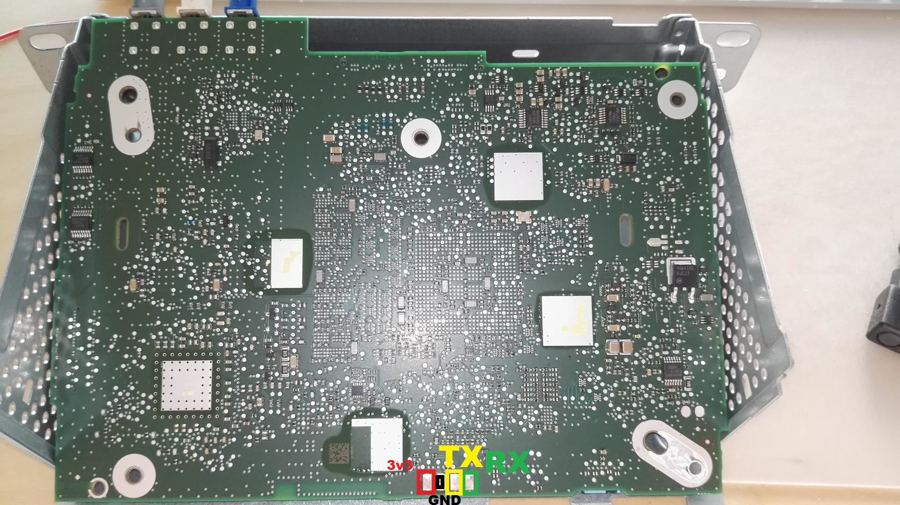

# SMEG+ Firmware Analysis

This repo will centralize few item founds on forums regarding SMEG firmware.

Thanks to @DarkSino and @pixx for their notes on SMEG inner mecanics.
Thanks to [@MWyann](https://github.com/Mwyann/psakey) that developped a RaspberryPi USB key that acts as a connected key from PSA.

Rather than trying to understand **vxWorks** that seems to act similarly to a kernel in linux, I digged into the upgrade process which sets everything at it's right place. Thus it offers the perfect opportunity to understand how the SMEG works. Cherry on the cake, the upgrade binary is in ELF format, and consequently analysis will be far more easy ! <br>
Thanks to a first pass on upgrade proccess, now I'm able to analyze efficiently the **vxWorks.bin**
<br>
<br>
Thanks to the new GHIDRA SRE tool, I'll now be able to share my disassembly work on vxWorks and upgrade process. **Feel free to contribute**<br>
GHIDRA archives are located in [ghidra](./ghidra) subdirectory.

## Table of contents
- [SMEG+ Firmware Analysis](#smeg-firmware-analysis)
  * [Table of contents](#table-of-contents)
  * [TODO](#todo)
  * [Findings](#findings)
  * [SMEG+ Hardware](#smeg-hardware)
  * [SMEG+ Memory Mapping](#smeg-memory-mapping)
  * [SMEG+ Partitions](#smeg-partitions)
  * [SMEG+ Firmware](#smeg-firmware)
    + [U-Boot](#u-boot)
    + [vxWorks](VXWORKS.md#vxworks)
      - [Binary Format](VXWORKS.md#binary-format)
      - [Supported hardware](VXWORKS.md#supported-hardware)
      - [Internal commands](VXWORKS.md#internal-commands)
        * [Basic](VXWORKS.md#basic)
        * [Mem](VXWORKS.md#mem)
        * [Interpreter, Object, Module, Various](VXWORKS.md#interpreter-object-module-various)
        * [File System](VXWORKS.md#file-system)
        * [Tasks](VXWORKS.md#tasks)
        * [Symbols](VXWORKS.md#symbols)
        * [Net](VXWORKS.md#net)
    + [FW Upgrade Process](UPGRADE.md#upgrade-process)
      - [1) UpgradeTask](UPGRADE.md#1--c-upgrade--upgradetask-c-upgrade---this-)
      - [2) ManageUBootUpdateAndReboot](UPGRADE.md#2--c-upgrade--manageubootupdateandreboot-c-upgrade---this-)
      - [3) ManageBootRomUpdateAndReboot](UPGRADE.md#3--c-upgrade--managebootromupdateandreboot-c-upgrade---this-)
      - [4) ManageRenesasUpdateAndReboot](UPGRADE.md#4--c-upgrade--managerenesasupdateandreboot-c-upgrade---this-)
      - [5) ManageBigQuickUpdate](UPGRADE.md#5--c-upgrade--managebigquickupdate-c-upgrade---this-)
      - [6) UpgradeHarmoniesIfNeeded](UPGRADE.md#6--c-upgrade--upgradeharmoniesifneeded-c-upgrade---this-)
    + [MAP Upgrade Process](#map-upgrade-process)
  * [Links](#links)


## TODO
- Switch to [GHIDRA SRE](https://ghidra-sre.org/)
- ~~Create an RPi Zero0W hotspot for longer remote acess to shell~~<br>
  \+ two mass storage luns (one for music, and another for automtic ZAR and Maps download from car)
- vxWorks disassembly
  * ~~parse and process embedded Symbol table~~
  * ~~parse all strings~~
  * ~~define shell commands structures~~
  * find the correct r2 (TOC) value.<br> **LOOKING for a PowerPC expert to understand**
- ~~Work on License file for maps update~~
  * ~~identify format and location~~
  * Test License file
- List all USB devices supported : VID/PID + class (EEM/MS/any other)
- List all internal commands (WIP)
- ~~test vxWorks commands~~ -> UPDATE of command list
- Dig on 3333 port server (GPS related)
- Dig on 20000 port server
- Find U-Boot location + dump ?
- Finish upgrade process analysis


## Findings

### License File (Activation Key)
Thanks to analysis of Upgrade process, it appears that any map upgrade that needs and Activation key to be typed on SMEG unit, can be skipped if the key is stored in a specific file.<br>
Just create a text file ```SMEG_PLUS_UPG/DATA/Licence``` with the 16 char of the key.<br>
No CRC files are required on this License file.<br>
**Tested and approved.**

### ???? (others to come)


## SMEG+ Hardware

    -> version
    VxWorks (for Freescale MPC5121E ADS (Rev 0.1)) version 6.7.
    Kernel: WIND version 2.12.
    Made on May 26 2017, 13:23:36.
    Boot line:
    usb(0,0)host:vxWorks h=192.168.10.2 e=192.168.10.1 u=5121 pw=5121 f=0x0 tn=DB600

Board reference on WindRiver<br>
https://marketplace.windriver.com/index.php?bsp&on=details&bsp=6901

MCU reference on NXP<br>
https://www.nxp.com/products/processors-and-microcontrollers/power-architecture-processors/mpc5xxx-55xx-32-bit-mcus/mobilegt-51xx-52xx/32-bit-power-architecture-microcontrollers:MPC5121e

Opened SMEG Unit (for physical UART connection)<br>
[](./pictures/SMEG_Unit-Back.jpg)

## SMEG+ Partitions

Based on TFFS (True Flash File System).<br>
vxWorks creates the following parts :

Type | Device Name                                           | Usage             | Contents
---: | ----------------------------------------------------- | ----------------- | -------------
   7 | [/romfs](./tree_dump/romfs.txt)                       | Internal NAND     | Debug binaries for audio & scheduler.bin
   3 | /ram                                                  | RAM               | Contains config files, but not readable from telnet
   3 | [/sdhc:0](./tree_dump/sdhc_0.txt)                     | Internal µSD      | Cartographie GPS + Cheat Codes x3 + TTS
   3 | [/sdhc:1](./tree_dump/sdhc_1.txt)                     | Internal µSD      | User Guide
   3 | /bd0                                                  | USB Mass Storage  | 
   3 | [/SYSTEM](./tree_dump/system.txt)                     | Internal NAND ?   | 
   3 | /SYSTEM_DATA                                          | Internal NAND ?   | 
   3 | [/SYSTEM_TMP_DATA](./tree_dump/system_tmp_data.txt)   | Internal NAND ?   | 
   3 | [/USER_DATA](./tree_dump/user_data.txt)               | Internal NAND ?   | 
   3 | [/USER_DATA_BACKUP](./tree_dump/user_data_backup.txt) | Internal NAND ?   | 
   3 | /EXTENDED_PARTITION                                   |


## SMEG+ Memory Mapping

Offset | Binary                | Comments
----------: | :--------------------- | -----------------
  0x00010000 | ELF files             | Dedicated space to load ELF files
  0x00200000 | vxWorks.bin           |     
  0x01000000 | f_BigQuick.bin@0x801  | Nav Binary is located in f_BigQuick.bin. The later embeds for ZLIB part. The first is the Nav binary. It can be extracted with binwalk              

## SMEG+ Firmware

SMEG relies on U-Boot and vxWorks softwares.

### U-Boot

    To Fill : U-Boot version
This software part is stored in NAND Flash out of any filesystem at location 0x????????<br>
For updates, this binary is located in "TBD", with a filename **u-boot-nand.bin**<br>

### [vxWorks](VXWORKS.md#vxworks) 
[(dedicated page)](VXWORKS.md#vxworks) 

### [FW Upgrade Process](UPGRADE.md#upgrade-process) 
This section details the Upgrade process for SMEG+ FW, based on ```upgrade.out``` located in the root of archive<br>
[(dedicated page)](UPGRADE.md#upgrade-process)

### [MAP Upgrade Process](MAP_UP.md#upgrade-process) 
This section details the Upgrade process for MAPS / ZAR, based on ```UpgPlugin.out``` located in the root of archive<br>

the upgrade process seems to be managed by the following function :
  
    _DWORD C_UPGRADE::UpgradeTask(C_UPGRADE *__hidden this)

As a summary, the upgrade procedure is made of many steps, no details to share so far.<br>
However, at some point in the time, the following steps applies :
1. ```CheckCompatibilityTask();``` - which initialize callback in plugin instance
2. ```CheckPresenceOfDRMOnMedia(this);``` - Check if DRM id available on SD<br>
   It verifies of the following file exists ```SMEG_PLUS_UPG/DATA/Licence```
3. ```CheckDRMMedia(this);``` - check DRM content and validity if DRM available on SD
4. and finally starts the upgrade.


## Links

- https://www.forum-peugeot.com/Forum/threads/rooter-le-smeg.9541
- https://github.com/Mwyann/psakey
- http://www.vxdev.com/docs/vx55man/vxworks/ref/rtnIndex.htm
- https://groups.google.com/forum/#!topic/comp.os.vxworks/njEArmJWxzU
- https://ghidra-sre.org/

<br>
